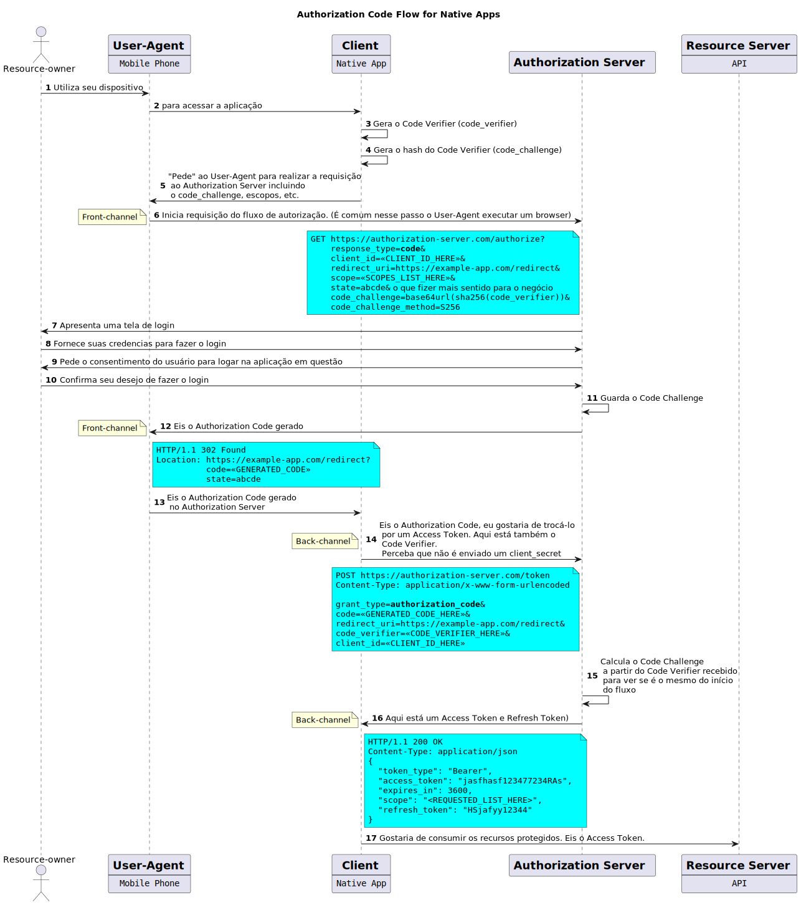
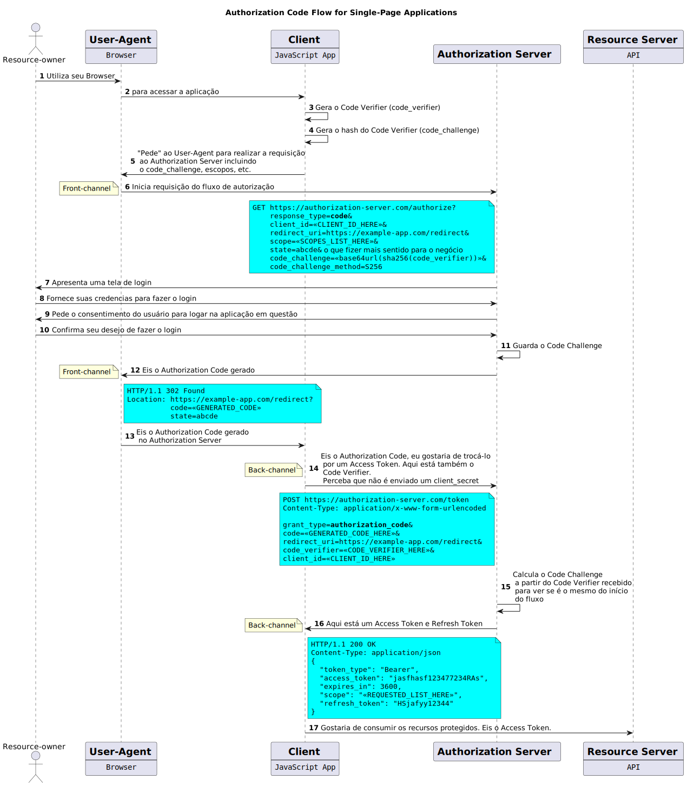

# oauth2-studies
Estudos sobre o framework OAuth 2.0

### Authorization Code Flow for Native Apps

### Authorization Code Flow for Single-Page Apps

### Referências
* OAuth 2.0 Authorization Framework: https://datatracker.ietf.org/doc/html/rfc6749;
* PKCE Extension: https://datatracker.ietf.org/doc/html/rfc7636.
